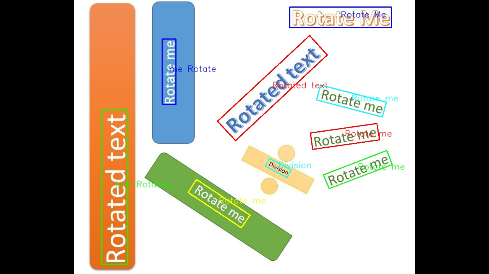

# LanyOCR

A general OCR to detect and recognize English texts in an image based on a combination of [EasyOCR](https://github.com/JaidedAI/EasyOCR) and [PaddleOCR](https://github.com/PaddlePaddle/PaddleOCR).

LanyOCR automatically merges text boxes into lines even for rotated texts.



# Getting Started
### Install dependencies
```
pip install -r requirements.txt
```

### Download pretrained models
```
bash download_models.sh
```

### Run example
```
python detect.py --merge_vertical true --image_path images/example.jpg
```

Faster version
```
python detect_fast.py --merge_vertical true --merge_boxes_inference false --image_path images/example.jpg
```

Even faster
```
python detect_fast.py --merge_vertical true --merge_boxes_inference true --image_path images/example.jpg
```

## Online API

You can try LanyOCR free on [RapidAPI](https://rapidapi.com/JC1DA/api/lanyocr)


## License

This project is licensed under the [MIT License](LICENSE).

## Credits
Special thanks to authors and developers of [EasyOCR](https://github.com/JaidedAI/EasyOCR) and [PaddleOCR](https://github.com/PaddlePaddle/PaddleOCR) projects.
