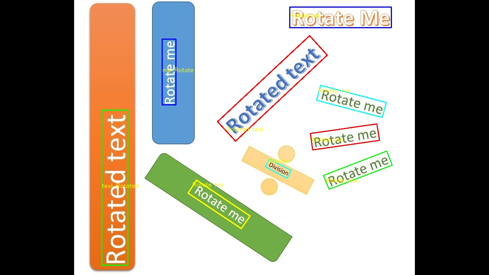
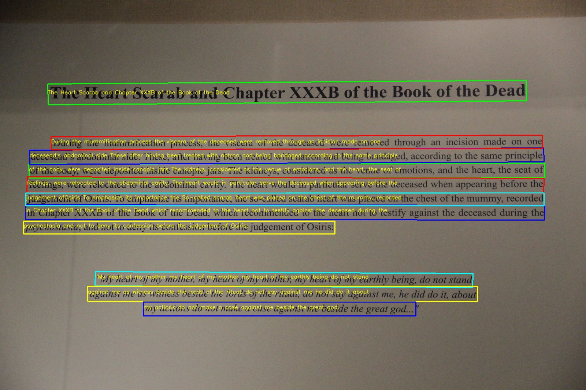

# LanyOCR

A general OCR to detect and recognize English texts in an image based on a combination of [EasyOCR](https://github.com/JaidedAI/EasyOCR) and [PaddleOCR](https://github.com/PaddlePaddle/PaddleOCR).

LanyOCR automatically merges text boxes into lines even for rotated texts.





# Getting Started
### Install dependencies
```
pip install -r requirements.txt
```

### Run example
```
PYTHONPATH=. python detect.py --merge_rotated_boxes true --merge_vertical true --image_path images/example1.jpg
```

Faster version, a bit less accurate
```
PYTHONPATH=. python detect.py --merge_rotated_boxes true --merge_vertical true --merge_boxes_inference true --image_path images/example1.jpg
```

Switch to different recognizer
```
PYTHONPATH=. python detect.py --merge_rotated_boxes true --merge_vertical true --recognizer_name paddleocr_en_mobile --image_path images/example1.jpg
```

Recognize other languages
```
PYTHONPATH=. python detect.py --merge_rotated_boxes true --merge_vertical true --recognizer_name paddleocr_french_mobile --image_path images/french_example1.jpg
```

Output image will be in outputs/output.jpg

**Supported Languages**
- English: paddleocr_en_server, paddleocr_en_mobile
- French: paddleocr_french_mobile
- Latin: paddleocr_latin_mobile

**Note**: Some unicode characters cannot be visualized correctly by OpenCV, please find the text lines in the console log.

## Online API

You can try LanyOCR free on [RapidAPI](https://rapidapi.com/JC1DA/api/lanyocr)

## To Do
    [x] Abstract Class/Interface for each component
        [x] LanyOcrDetector: outputs locations of text boxes        
        [x] LanyOcrMerger: merge text boxes into text lines
        [x] LanyOcrRecognizer: convert text boxes/lines into text
        [x] LanyOcrAngleClassifier: estimate the angle of a text box/line

    [ ] Multi-languages support
        [X] French        
        [X] Latin
        [ ] German

    [ ] Inference using multi-models to improve accuracy
        [ ] Add interface to support voting policy

    [ ] Expose flags to configure each component in OCR pipeline

## Known issues
    [ ] Visualization step: some small texts are drawn in incorrect directions


## License

This project is licensed under the [MIT License](LICENSE).

## Credits
Special thanks to authors and developers of [EasyOCR](https://github.com/JaidedAI/EasyOCR) and [PaddleOCR](https://github.com/PaddlePaddle/PaddleOCR) projects.
